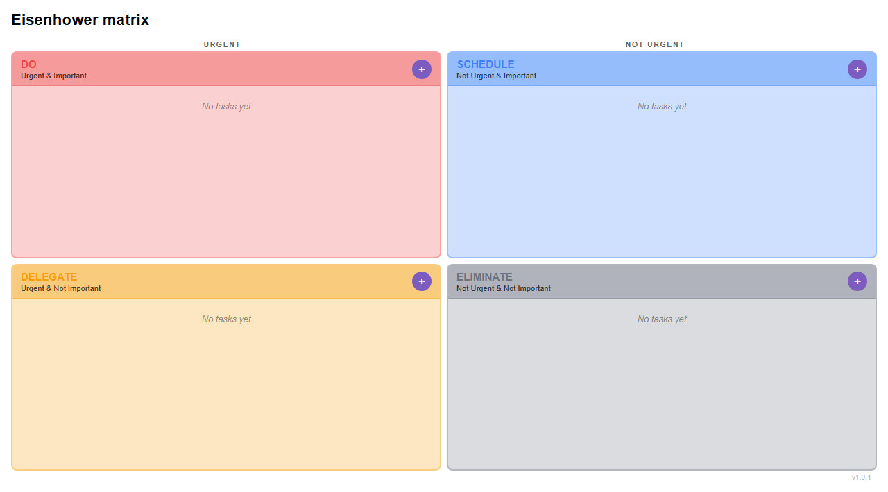
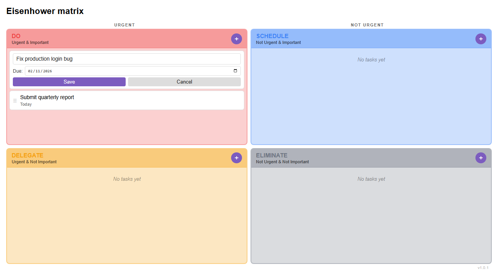
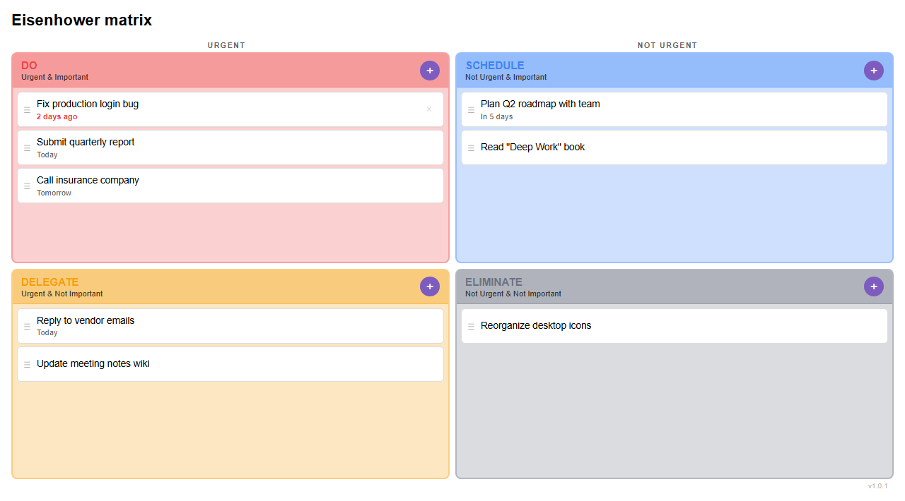
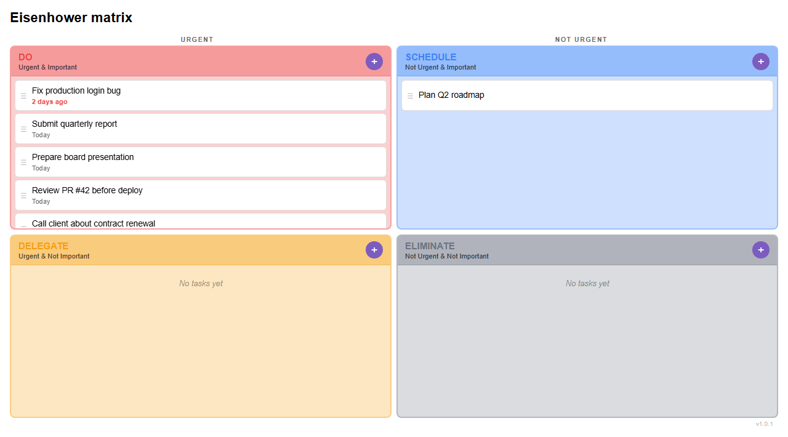
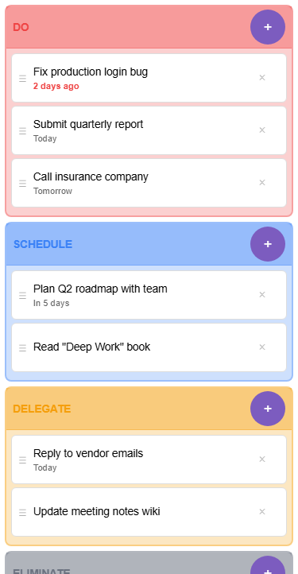
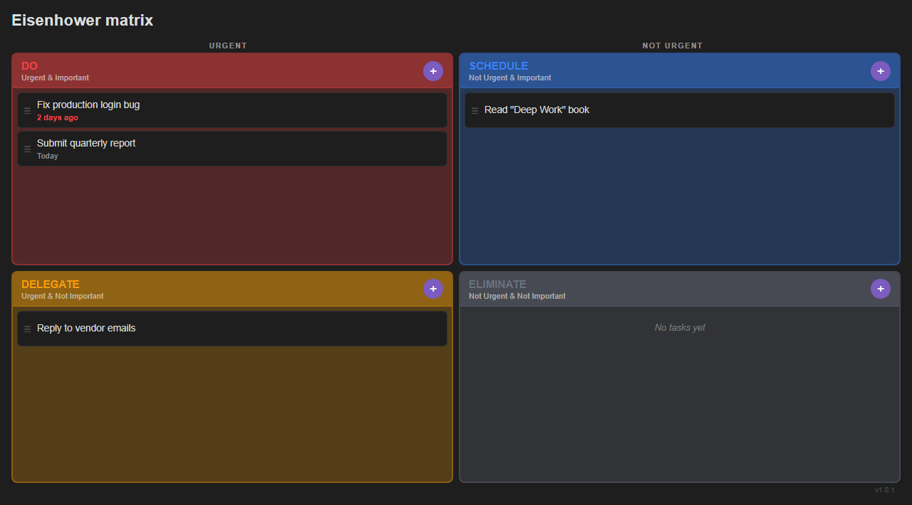

# PM Review: Eisenhower Matrix for Obsidian

**Reviewer:** Claude (Principal PM sub-agent)
**Date:** 2026-02-13
**Version reviewed:** v1.0.1
**Method:** Codebase analysis, Playwright UI testing (desktop + mobile), competitive analysis

---

## Product Summary

**What it does:** An Obsidian community plugin that renders an interactive 2x2 Eisenhower Matrix (Do / Schedule / Delegate / Eliminate) for visual task prioritization. Users create, edit, delete, and drag-drop tasks between quadrants. Due dates display as relative text ("Today", "2 days ago") with overdue highlighting.

**Who it's for:** Obsidian power users who want a lightweight, visual task triage tool that lives alongside their notes — without leaving the app for a separate to-do list.

**Current state:** Feature-complete for an MVP. Solid engineering foundation (38 unit tests, 32 Playwright tests, CI pipeline). Ready for community plugin listing. What follows are observations about where the UX can improve.

---

## Key User Flows Tested

### Flow 1: First Launch (Empty State)

**What happens:** User opens the matrix and sees four colored quadrants, each showing italic "No tasks yet" text and a purple + button.

**Observations:**
- **No onboarding.** A first-time user unfamiliar with the Eisenhower framework gets no guidance on what "Do" vs. "Schedule" vs. "Delegate" vs. "Eliminate" mean in practice. The subtitle text ("Urgent & Important") helps, but there's no explanation of *what kind of tasks* belong in each quadrant.
- **The empty state is identical across all four quadrants.** "No tasks yet" is descriptive but not actionable. Compare to Priority Matrix's "Tap on empty space to add an item" — which teaches the interaction while filling the void.
- **The URGENT / NOT URGENT axis label at the top** is helpful but there's **no IMPORTANT / NOT IMPORTANT label** on the vertical axis. Users have to infer the Y-axis from the subtitles. This is a missed affordance.
- **The + button uses Obsidian's accent color** (purple by default), which contrasts well in light theme but is visually disconnected from the quadrant's own color identity.

### Flow 2: Adding Tasks

**What happens:** User clicks +, form slides open below the task list with a text input, date picker, and Add/Cancel buttons.

**Observations:**
- **Good:** Form appears inline, input auto-focuses, Enter submits, Escape cancels. Keyboard users are served well.
- **Good:** Mobile scroll-into-view on focus (300ms delay for keyboard) — thoughtful touch.
- **Issue:** No way to quickly add multiple tasks. After adding one task, the form closes and the user must click + again. In a triage session, users often want to brain-dump 5-10 tasks rapidly.
- **Issue:** The due date field is a raw `<input type="date">`. No natural language input ("tomorrow", "next Friday"). This is a standard feature in TickTick and Amazing Marvin.
- **Missing:** No way to add a task description or notes. Title-only tasks work for simple items but break down for anything requiring context.

### Flow 3: Editing a Task

**What happens:** Clicking a task title replaces the task card with an inline edit form (title input + date picker + Save/Cancel).

**Observations:**
- **Good:** The edit form is clean and focused. Title is pre-selected for quick replacement.
- **Issue:** There's no visual affordance that tasks are clickable/editable. No hover cursor change on the content area (only the drag handle shows `cursor: grab`). New users won't discover editing by accident.
- **Issue:** While a task is being edited, it loses its drag handle and delete button. If the user wanted to delete while editing, they must Cancel first, then find the tiny × button.

### Flow 4: Deleting a Task

**What happens:** Hovering over a task reveals a × button on the right side.

**Observations:**
- **Issue:** The × button is only visible on hover (`opacity: 0` → `1`). On mobile, it has `opacity: 0.6` by default, which is better — but on desktop, a user who doesn't hover over tasks will never discover the delete affordance.
- **Critical missing feature:** No confirmation dialog before deletion. One accidental click permanently destroys a task. There's no undo, no trash, no recovery mechanism. This is the single highest-risk UX gap.
- **Issue:** The × character is a plain text glyph, not an icon. It looks slightly different across platforms and doesn't match the + icon (which uses Obsidian's SVG `setIcon`).

### Flow 5: Drag and Drop

**What happens:** Desktop: native HTML5 drag from the grab handle. Mobile: 250ms long-press initiates drag with a visual clone.

**Observations:**
- **Good:** The drag handle (☰) is a clear affordance. Drop targets highlight with accent color border + box shadow.
- **Issue:** No visual feedback during drop — the task just disappears and re-renders. A brief animation (slide or fade) would make the action feel more intentional.
- **Issue:** Reordering within the same quadrant is not supported. Tasks always append to the end when moved. For a prioritization tool, the inability to order tasks within a quadrant is a significant gap.

### Flow 6: Overloaded Quadrant

**What happens:** When Q1 has 6 tasks, the grid's `1fr 1fr` row sizing means Q1 gets the same height as Q3 (which is empty). The 5th and 6th tasks are clipped or barely visible.

**Observations:**
- **This is a real usability problem.** The entire point of Q1 is "do these first" — clipping the user's most urgent tasks defeats the purpose of the tool.
- The `.em-task-list` has `overflow-y: auto` but the fixed grid height means the scrollbar appears inside a tiny area, making it hard to interact with.
- **No task count badges** in the quadrant headers. Users can't glance at the matrix and see "Q1: 6 tasks, Q3: 0 tasks" — they have to visually count. The competing deviante06 plugin already has optional task counters.

### Flow 7: Mobile Layout

**What happens:** Below 600px, the grid switches to a single-column stack. Title header is hidden (Obsidian shows it in the nav bar). Axis labels are hidden.

**Observations:**
- **Good:** The stacked layout works well. Tasks are readable, tap targets are 44px+, delete buttons are always visible.
- **Issue:** The Q4 quadrant is cut off at the bottom on a populated matrix. Users must scroll to see it, but there's no visual indicator that more content exists below the fold.
- **Missing:** No collapsible quadrants on mobile. On a phone, scrolling past 4 full quadrants is tedious. Letting users collapse less-used quadrants (Q4 especially) would reduce scrolling.
- **Issue:** The axis labels (URGENT / NOT URGENT) are hidden on mobile. Without them, the quadrant color coding and header text are the only indicators of what each quadrant represents.

### Flow 8: Dark Theme

**What happens:** Task card backgrounds use `var(--background-primary)` which in dark themes is very dark, sitting on the slightly lighter quadrant body.

**Observations:**
- **Issue:** Task cards in dark theme have very low contrast against the quadrant background. The card borders (`rgba(255, 255, 255, 0.08)`) are nearly invisible. Tasks visually merge with the quadrant body rather than appearing as distinct cards.
- **Good:** The quadrant header colors (red, blue, amber, gray) remain vivid and distinguishable in dark mode.
- **Good:** Overdue text ("2 days ago") remains red and readable.

---

## UX Issues Summary

| # | Issue | Severity | Flow |
|---|-------|----------|------|
| 1 | No delete confirmation / undo | High | Delete |
| 2 | Overloaded quadrant clips tasks | High | Overloaded |
| 3 | No task reordering within quadrant | Medium | Drag & Drop |
| 4 | No onboarding or per-quadrant guidance | Medium | First Launch |
| 5 | No task count in quadrant headers | Medium | All |
| 6 | Delete button invisible until hover (desktop) | Medium | Delete |
| 7 | No rapid multi-task entry | Medium | Add |
| 8 | No indication tasks are click-to-edit | Low | Edit |
| 9 | Dark theme card contrast too low | Low | Dark Theme |
| 10 | No within-view keyboard shortcuts | Low | All |
| 11 | No scroll indicator on mobile for below-fold quadrants | Low | Mobile |
| 12 | Missing vertical axis label (IMPORTANT / NOT IMPORTANT) | Low | First Launch |

---

## Feature Recommendations (MoSCoW)

### Must Have (before promoting widely)

**M1. Delete confirmation or undo**
Destructive actions need a safety net. Options: (a) confirmation modal, (b) 5-second undo toast, (c) soft-delete with trash. Undo toast is the lightest-weight option and the least disruptive to flow. *Observed: one click permanently destroys a task with no recovery.*

**M2. Fix overloaded quadrant clipping**
When one quadrant has many tasks and others are empty, the equal-height grid clips content. Options: (a) switch to `auto` row height with a max, (b) make the grid rows respond to content (`grid-template-rows: auto auto` on overflow), (c) add a "show more" expander. *Observed: Q1 with 6 tasks clips the 5th and 6th.*

### Should Have (next iteration)

**S1. Task count badges in quadrant headers**
Show "(3)" or a small badge next to the quadrant action name. Gives instant workload visibility. *Observed: no way to see task distribution at a glance. Competitor (deviante06) already has this.*

**S2. Within-quadrant task reordering**
Let users drag tasks up/down within the same quadrant to set priority order. Currently tasks always append to the end on move. *Observed: no reorder capability exists.*

**S3. Richer empty states with per-quadrant guidance**
Replace "No tasks yet" with contextual text per quadrant:
- Q1 (Do): "Tasks that need immediate action"
- Q2 (Schedule): "Important but not urgent — plan these"
- Q3 (Delegate): "Urgent but not your priority"
- Q4 (Eliminate): "Neither urgent nor important — consider dropping"

Add a subtle "Tap + to add your first task" call-to-action. *Observed: generic empty state provides no framework education.*

**S4. Keep add form open for rapid entry**
After adding a task, keep the form open and clear the input instead of closing it. Let users close explicitly with Cancel or Escape. *Observed: form closes after each task, requiring re-click of + for every entry.*

### Could Have (future enhancement)

**C1. Keyboard shortcuts for in-view navigation**
- `N` or `Enter` — open add form in focused quadrant
- Arrow keys — navigate between tasks
- `Shift+Arrow` — move task to adjacent quadrant
- `E` — edit focused task
- `Delete` / `Backspace` — delete with confirmation

No Obsidian Eisenhower plugin offers in-view keyboard shortcuts. This would be a genuine differentiator. *Observed: only keyboard support is Enter/Escape within forms.*

**C2. Collapsible quadrants on mobile**
Add a tap-to-collapse affordance on quadrant headers. Collapsed quadrants show just the header + task count badge. Reduces scrolling when users only care about Q1 and Q2. *Observed: mobile requires scrolling past all 4 full-height quadrants.*

**C3. Task completion (checkboxes)**
Add a checkbox to mark tasks as "done" rather than just deleting them. Completed tasks could show with strikethrough for a session, then auto-archive. This aligns with how most users mentally model task management. *Observed: the only way to remove a task is permanent deletion.*

**C4. Vertical axis label**
Add "IMPORTANT" and "NOT IMPORTANT" labels on the left side of the grid, mirroring the horizontal URGENT / NOT URGENT labels. *Observed: vertical axis is only implied by subtitle text.*

**C5. Improve dark theme card contrast**
Increase card border opacity in dark theme from `0.08` to `0.15-0.2`, or add a subtle background offset (e.g., slightly lighter than `--background-primary`). *Observed: cards blend into quadrant background in dark mode.*

### Won't Have (out of scope for a focused Obsidian plugin)

- Gantt charts / timeline views (Priority Matrix territory)
- Team collaboration / delegation tracking
- Third-party integrations (Jira, Outlook, etc.)
- Recurring tasks
- Natural language date parsing (complexity not justified for the form factor)
- Pomodoro timer integration

---

## Quick Wins vs. Strategic Bets

### Quick Wins (< 1 hour each, high impact)

| Win | Effort | Impact |
|-----|--------|--------|
| Task count badges in headers | ~30min | Instant workload visibility |
| Richer empty states per quadrant | ~15min | Better first-time experience |
| Delete confirmation toast | ~30min | Prevents accidental data loss |
| Keep add form open after submit | ~5min | Faster task entry |
| Vertical axis label | ~10min | Completes the matrix metaphor |
| Dark theme card border bump | ~5min | Better readability |

### Strategic Bets (larger effort, potential differentiators)

| Bet | Effort | Why it matters |
|-----|--------|----------------|
| Within-quadrant reordering | ~2hr | Core to a prioritization tool — "what do I do FIRST within Q1?" |
| Keyboard shortcuts | ~3hr | No Obsidian competitor has this. Power users will love it. |
| Task completion (checkboxes) | ~2hr | Shifts the plugin from "triage tool" to "task manager". |
| Collapsible mobile quadrants | ~2hr | Dramatically improves mobile UX for users with many tasks. |
| Fix grid overflow for overloaded quadrants | ~1hr | Prevents content clipping — a correctness issue. |

---

## Competitive Position

**vs. deviante06/obsidian-eisenhower-matrix** (most direct competitor):
- **You win on:** Touch drag-and-drop, due dates, mobile CSS optimization, JSON storage performance
- **They win on:** Task counts, Markdown-based storage (interop with other plugins), color toggle setting
- **Gap to close:** Task counts (quick win), settings panel

**vs. Standalone apps** (Priority Matrix, TickTick, Focus Matrix):
- These are in a different league — full-featured apps with cloud sync, team features, native mobile.
- **Your advantage:** Zero context-switching. Obsidian users don't leave their vault. That's the whole value prop.
- **Don't try to compete on features.** Compete on integration and simplicity.

---

## Bottom Line

The plugin is a clean, well-engineered MVP. The core interaction model (add, edit, drag, delete across 4 quadrants) works. The visual design is appealing and theme-aware. Mobile layout is thoughtfully handled.

The three changes that would most improve the product right now:
1. **Delete confirmation** — because losing a task to a misclick erodes trust
2. **Fix quadrant overflow** — because clipping urgent tasks defeats the core purpose
3. **Task count badges** — because a 30-minute change gives users instant workload visibility

Everything else is enhancement. Ship these three and the plugin is solid for broad adoption.
