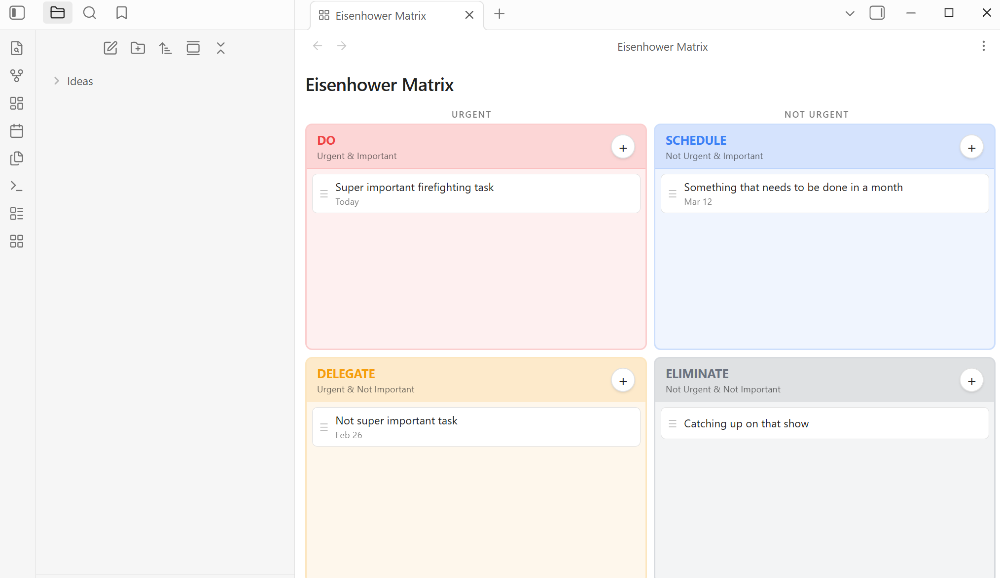
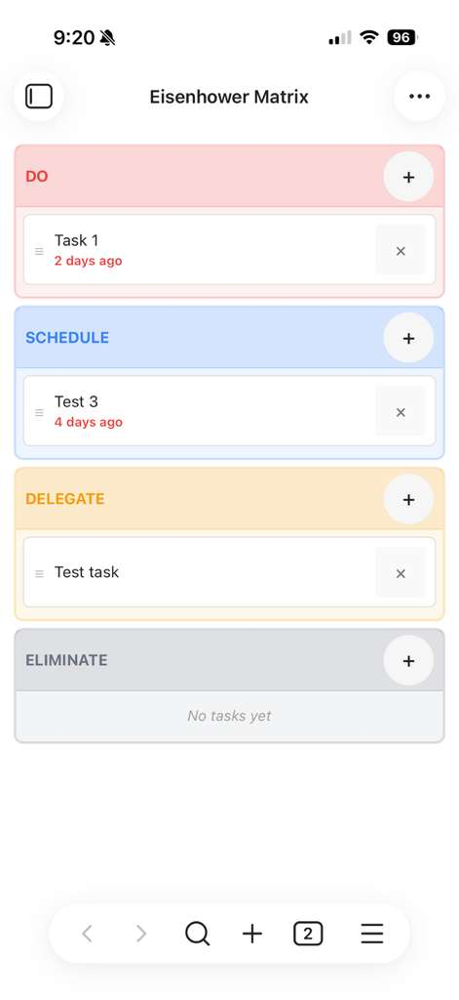

# Eisenhower Matrix for Obsidian

Prioritize your tasks by urgency and importance, right inside Obsidian.




## Features

| Feature | Description |
|---------|-------------|
| **4-quadrant matrix** | Do, Schedule, Delegate, Eliminate — the classic Eisenhower layout |
| **Drag and drop** | Move tasks between quadrants on desktop. Long-press to drag on mobile |
| **Due dates** | Relative formatting (Today, Tomorrow, 3 days ago) with overdue highlighting |
| **Inline editing** | Click any task to edit its title or due date in place |
| **Mobile friendly** | Responsive stacked layout that works on phones and tablets |
| **Theme aware** | Adapts to your light or dark Obsidian theme |

<details>
<summary>Mobile screenshot</summary>



</details>

## Installation

1. Open **Settings > Community plugins** in Obsidian
2. Turn off **Restricted mode** if prompted
3. Click **Browse** and search for **Eisenhower Matrix**
4. Click **Install**, then **Enable**

## Usage

Open the matrix from the ribbon icon or the command palette (**Open Eisenhower Matrix**).

- **Add a task** — tap the **+** button in any quadrant
- **Edit a task** — click on it to change the title or due date
- **Move a task** — drag it to a different quadrant (long-press on mobile)
- **Delete a task** — click the **x** button

## Development

```bash
npm install
npm run dev      # watch mode
npm run build    # production build
npm test         # run tests
```

## License

[MIT](LICENSE)
